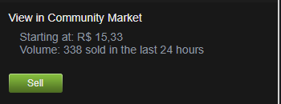

# Skins Prices Tracker in Excel
[](https://www.python.org/)

## Why should you use it?
If you have a lot of steam items it's hard to know the price you paid for each skin and also you have to manually go to your inventory to see the current prices of each skin, with this Python script you just write the name of each skin you want to track and the price you paid for it, the script will then get the current price for your.

## Sample


## How to use it
First install the requirements
```sh
python -m pip install -r requirements.txt
```

### To write skin names go to your inventory and choose a skin, then click on View in community market


### Now you just have to copy the name in the URL like shown below and paste it to the excel, always run the script before opening the excel file


### If you want to change the currency, game or file name you can change them in the beginning  of the code


[Link](https://steam-community-market.readthedocs.io/en/latest/pages/enums.html#esteamcurrency) of Suported Currencys and games
